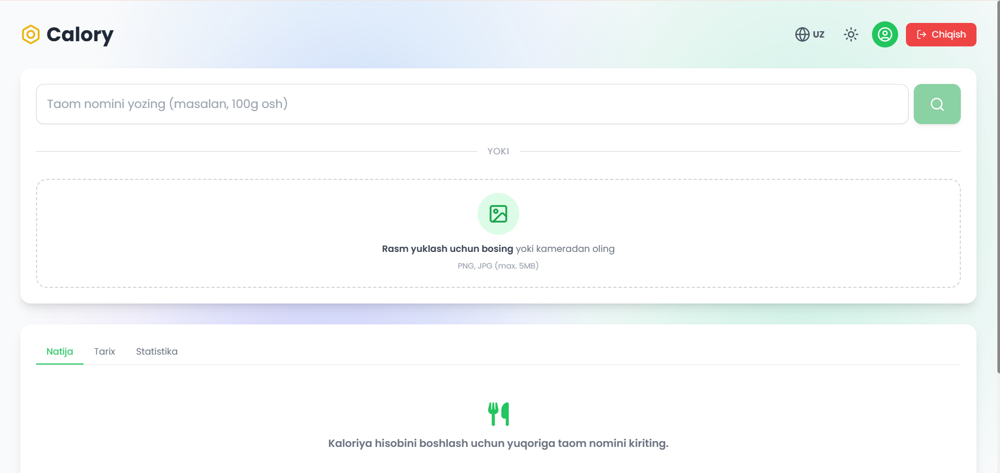
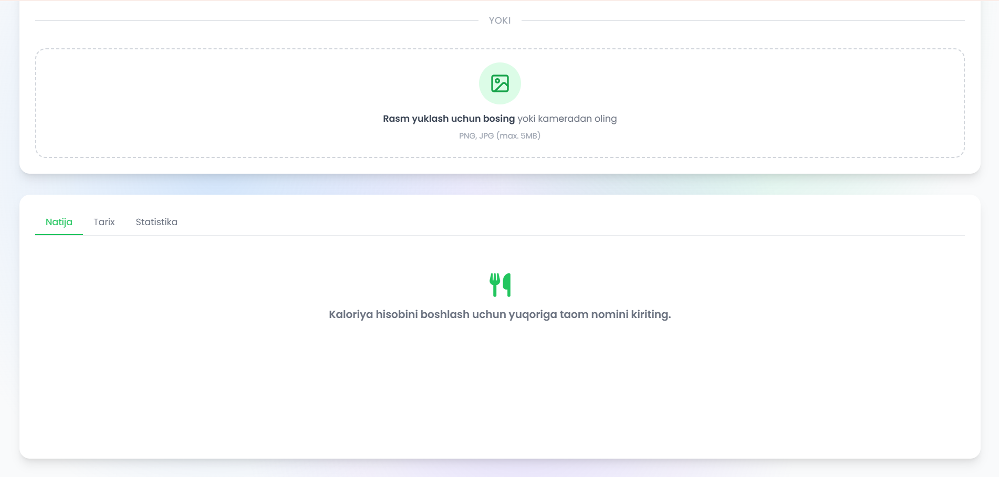
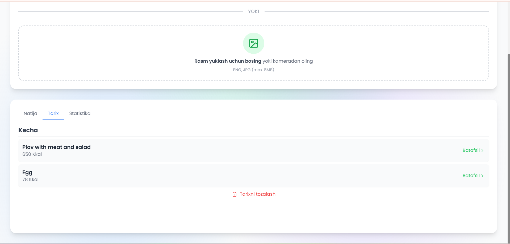
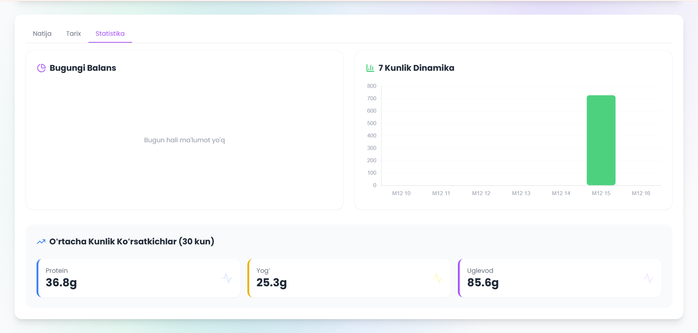
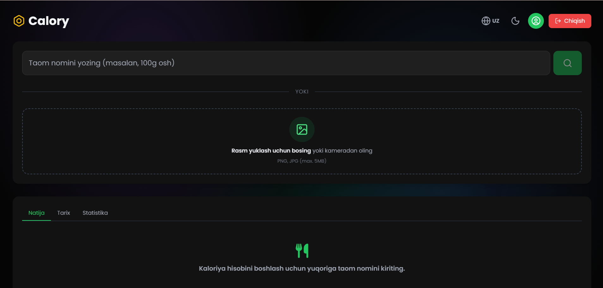
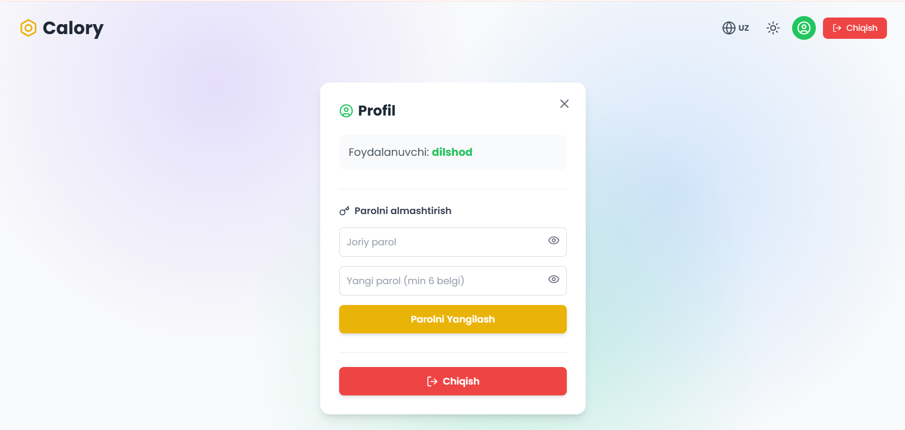
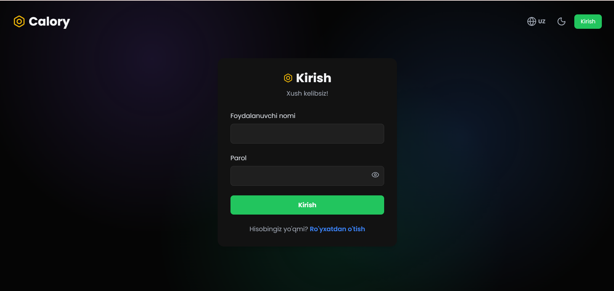
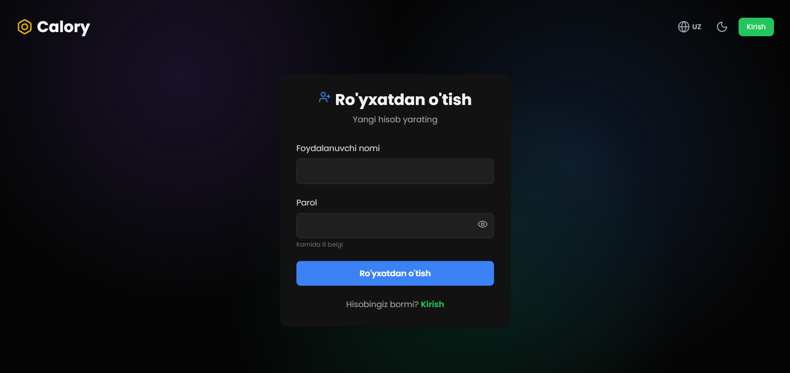
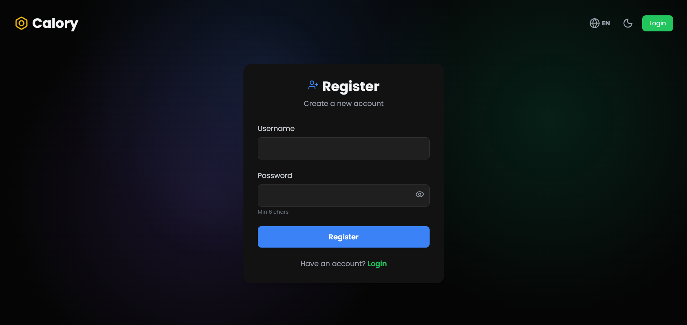
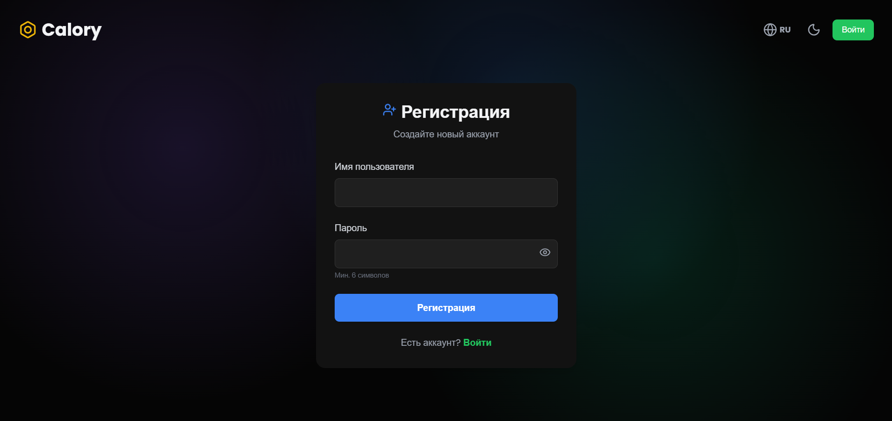

# Calory Web App - Kaloriya Hisoblagich

Sun'iy intellekt yordamida ovqat rasmlarini va matnlarini tahlil qilib, kaloriyalarni hisoblaydigan veb-ilova.

## 📸 Skrinshot'lar

### Bosh sahifa


### Hisoblash


### Tarix


### Statistika


### Qorong'u rejim


### Profil


### Kirish


### Ro'yxatdan o'tish


### Ko'p tillilik (Ingliz tili)


### Ko'p tillilik (Rus tili)


## 🌐 Demo

https://calory-web-app.vercel.app/

## 🏗️ Arxitektura

Loyiha ikki qismdan iborat:

### 1. Frontend (React + Vite)
- `frontend/` papkasida joylashgan
- React, Tailwind CSS va Axios yordamida qurilgan
- Foydalanuvchi interfeysi, autentifikatsiya va ma'lumotlarni vizualizatsiya qilish

### 2. Backend (PHP)
- `backend/` papkasida joylashgan
- Oddiy PHP API (`api/`) va JSON fayllari (`db/`) orqali ma'lumotlarni saqlash
- Umumiy hosting xizmatlarida (AlwaysData, XAMPP) ishlatish uchun mo'ljallangan

## 🚀 O'rnatish va mahalliy ishga tushirish

### Talablar
- Node.js (Frontend uchun)
- PHP / XAMPP (Backend uchun)

### 1-qadam: Backend sozlash
1. XAMPP ishga tushirilganligiga ishonch hosil qiling (Apache)
2. Loyiha `c:\xampp\htdocs` papkasida bo'lishi kerak
3. Backend API manzili: `http://localhost/Calory_Web_app/backend/api/`

### 2-qadam: Frontend sozlash
1. Terminal orqali `frontend/` papkasiga o'ting:
   ```sh
   cd frontend
   ```
2. Kerakli kutubxonalarni o'rnating:
   ```sh
   npm install
   ```
3. Ishlab chiqish serverini ishga tushiring:
   ```sh
   npm run dev
   ```
4. Brauzerda ko'rsatilgan manzilda ilovani oching (odatda `http://localhost:5173`)

## 📦 Joylashtirish (Deployment)

### Frontend (Vercel)
- `frontend` papkasini Vercel'ga yuklang
- Build buyrug'i: `npm run build`
- Chiqish papkasi: `dist`

### Backend (AlwaysData yoki boshqa PHP hosting)
- `backend` papkasini PHP hosting'ga yuklang
- `frontend/src/services/api.js` faylidagi API manzilini yangilang

## ✨ Imkoniyatlar

- **Sun'iy intellekt bilan hisoblash**: Matn yoki rasm orqali kaloriyalarni baholash
- **Foydalanuvchi tizimi**: Ro'yxatdan o'tish va kirish
- **Qorong'u rejim**: To'liq qo'llab-quvvatlanadi
- **Statistika**: Diagrammalar va kunlik tahlil
- **Ko'p tillilik**: O'zbek, Rus va Ingliz tillari

## 🛠️ Texnologiyalar

**Frontend:**
- React 18
- Vite
- Tailwind CSS
- Axios
- Chart.js
- Lucide Icons

**Backend:**
- PHP
- JSON fayl bazasi
- Open Router APi

